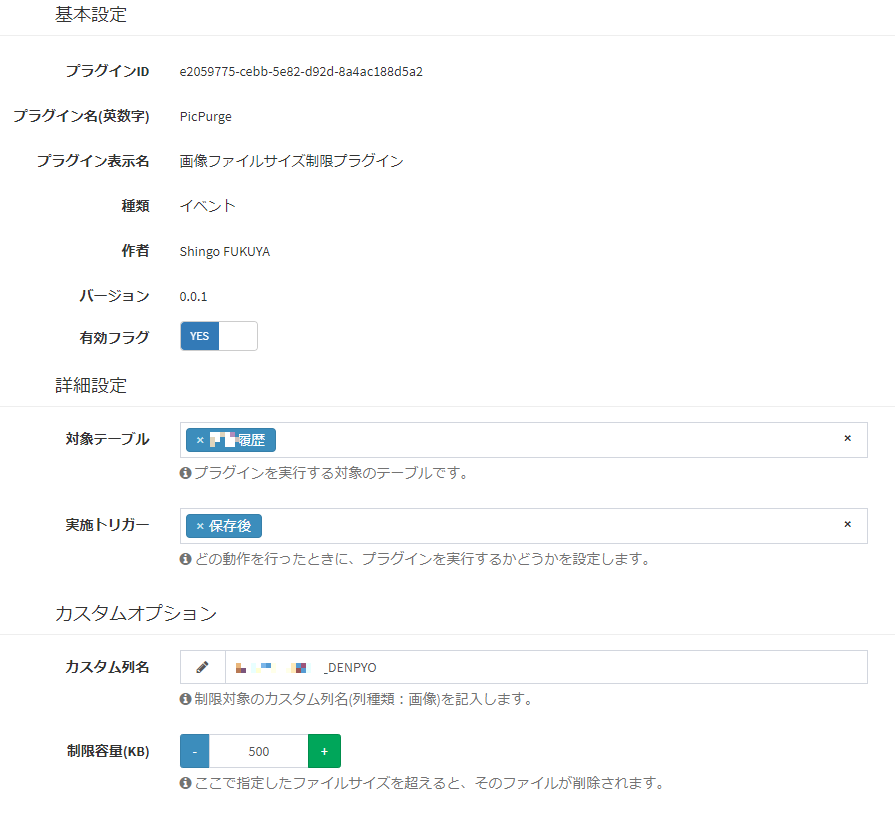

# Exment用プラグイン 特定カスタム列のファイルサイズ制限 - PicPurge
画像カスタム列において、指定したカスタム列を標準のアップロード制限に加え独自に制限を加えるプラグインです。新規レコード保存時に上限を超えていた場合、そのレコードが追加後即座に削除されます（削除済に移動）。

## 実行方法
- プラグインをインストールします。

- 該当プラグインの管理ページで、使用する対象テーブルなどの設定を行います。

- 実施トリガーは「保存後」としてください。

   

## 補足
本プラグインは、マジックコードでパスが入っている部分があります。作者の力不足が原因です。
パス名をデフォルトの"admin"から変更している場合うまく動作しない場合などがあります。

## 動作確認をしたバージョン
Exment v5.0.6
